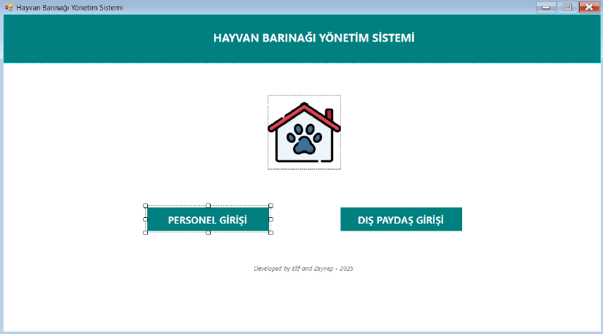
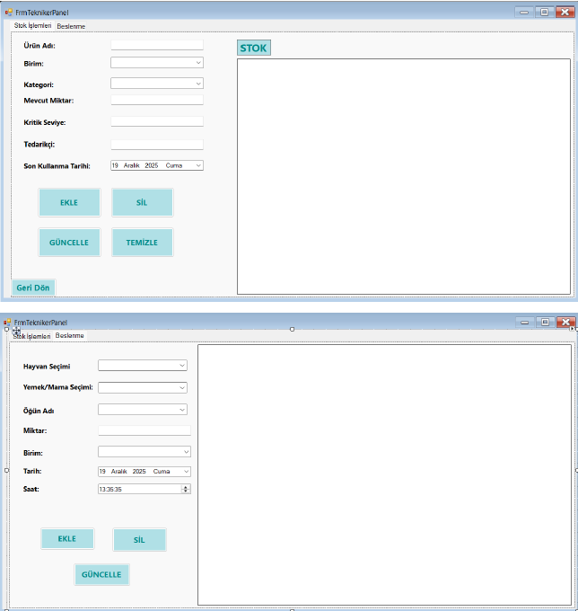
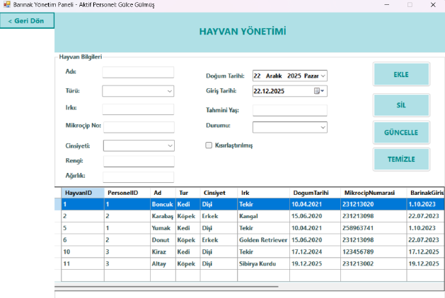
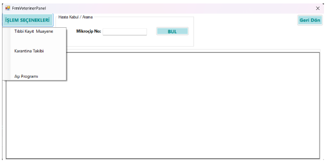

# Animal Shelter Management System  
## Hayvan Barınağı Yönetim Sistemi 🐾

A comprehensive desktop application developed to manage daily operations of an animal shelter, including animal records, health tracking, staff authorization, inventory management, and donation monitoring.

Bu proje, bir hayvan barınağındaki tüm operasyonların (hayvan takibi, sağlık süreçleri, personel yetkilendirme, stok ve bağış yönetimi) merkezi ve güvenli bir şekilde yönetilmesini amaçlayan masaüstü bir yazılımdır.

---

## 👩‍💻 Developers
- zgulceg0
---

## 🎯 Project Purpose | Projenin Amacı

**EN:**  
The main goal of this project is to digitize animal shelter operations, ensure secure data storage, and enable role-based access for different personnel such as administrators, veterinarians, and technicians.

**TR:**  
Bu projenin temel amacı, hayvan barınağındaki günlük işlemleri dijital ortama taşımak, verileri güvenli şekilde saklamak ve farklı yetkilere sahip personelin koordineli çalışmasını sağlamaktır.

---

## 🧱 System Architecture & Technologies  
### Sistem Mimarisi ve Kullanılan Teknolojiler

- **Programming Language:** C# (.NET Framework)
- **UI Technology:** Windows Forms (WinForms)
- **Database:** Microsoft SQL Server (MSSQL)
- **Data Access:** ADO.NET  
  (`SqlConnection`, `SqlCommand`, `SqlDataReader`, `SqlDataAdapter`, `SqlTransaction`)
- **Architecture:** Layered Architecture, OOP principles

---

## 🔐 Role-Based Access Control (RBAC)  
### Rol Tabanlı Yetkilendirme

| Role | Description |
|----|----|
| **Admin** | Staff management, donation tracking, system monitoring |
| **Veterinarian** | Diagnosis, treatment, vaccination, quarantine |
| **Technician / Staff** | Feeding records, stock tracking |
| **External User** | Donation and registration |

---

## 🖥️ Main Features | Temel Özellikler

### 🐶 Animal Management
- Animal registration with microchip number
- Physical attributes (age, weight, breed, color)
- Status tracking (In shelter / Adopted)

### 💉 Health Management
- Medical examination records
- Vaccination schedules
- Quarantine tracking

### 📦 Inventory & Feeding System
- Food & medicine stock tracking
- Automatic stock decrease after feeding
- Transaction-based operations for data consistency

### 👥 Staff Management
- Add / update / delete personnel
- Role-based panel redirection

### 💰 Donation Tracking
- External users can donate
- Admin can view and manage donations

---

## 🔄 CRUD Operations Examples

- **CREATE:** Feeding record with automatic stock update (Transaction-based)
- **READ:** Stock listing with filtering and ordering
- **UPDATE:** Animal status changes (e.g., neutered, adopted)
- **DELETE:** Secure personnel deletion with user confirmation

---

## 🛠️ Problems Encountered & Solutions  
### Karşılaşılan Sorunlar ve Çözümler

- **Data consistency issues** → Solved using `SqlTransaction`
- **Inactive animals appearing in lists** → SQL filtering (`WHERE MevcutDurum='Barınakta'`)
- **Form navigation issues** → `Hide()` & `ShowDialog()` usage
- **User input errors** → Validation & Try-Catch blocks
- **UI layout breaking** → Fixed form size and layout settings

---

## 📌 Conclusion | Sonuç

**EN:**  
The Animal Shelter Management System is a secure, modular, and user-friendly desktop application that successfully integrates database management with an intuitive interface.

**TR:**  
Hayvan Barınağı Yönetim Sistemi; veri güvenliği yüksek, modüler ve geliştirilmeye açık bir masaüstü uygulaması olarak başarıyla tamamlanmıştır.

---

## 📜 License
This project is developed for educational purposes.

## 📸 Application Screenshots

